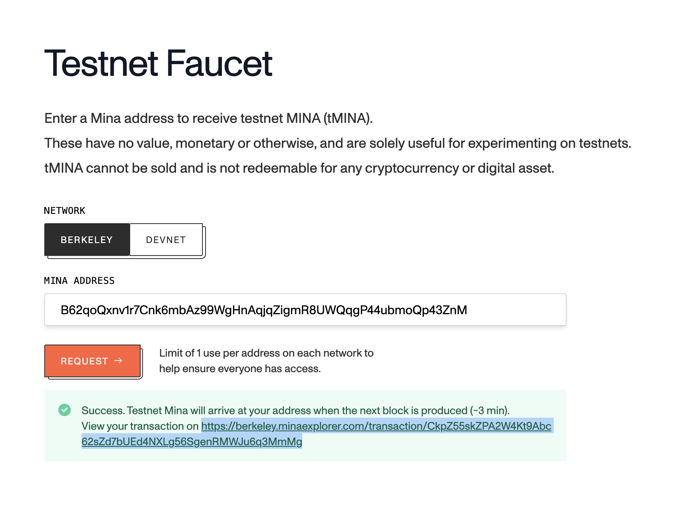
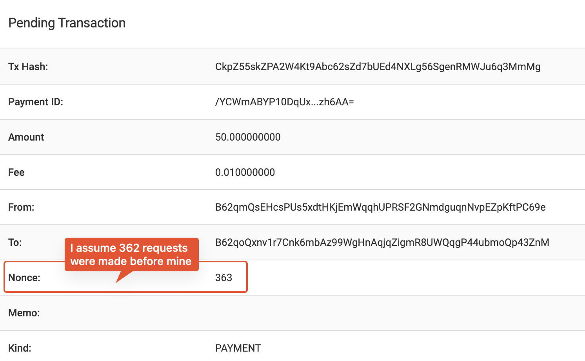
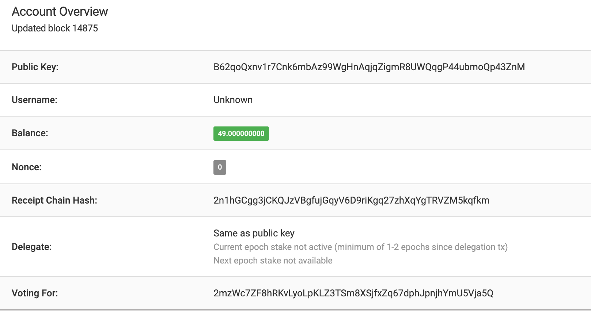
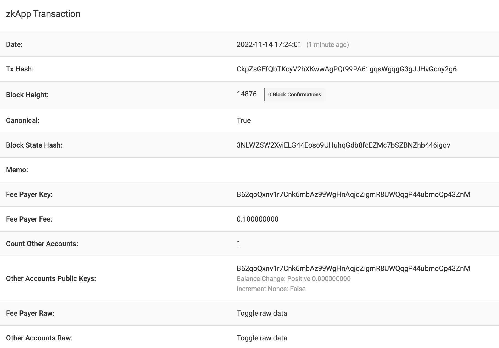
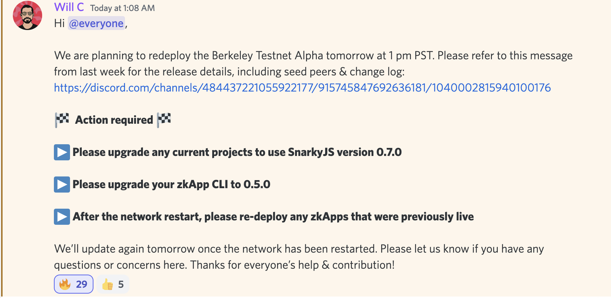

# Mina

## Methodology

I write in this journal while I am exploring the Mina Protocol. I am not an expert in this field, but I am a developer who is interested in learning more about the Mina Protocol. I am not affiliated with Mina in any way.

This is not a deep dive, but more of a quick journal of my experience with Mina. This journal is not meant to be a tutorial, but rather a quick reference for myself and others who may be interested in using Mina.

## Documentation

I started from the official documentation, specifically the Developer section:

https://docs.minaprotocol.com/zkapps

## Installation

Pretty easy to install

```sh
$ npm install -g zkapp-cli
```

Once that is done, I have access to the `zk` cli tool.

```sh
$ zk                 
Usage: zk <command> [options]

Commands:
  zk project [name]  Create a new project                     [aliases: proj, p]
  zk file [name]     Create a new file & test                       [aliases: f]
  zk config          Add a new deploy alias
  zk deploy [alias]  Deploy or redeploy a zkApp
  zk example [name]  Create an example project                      [aliases: e]
  zk system          Show system info                          [aliases: sys, s]

Options:
  -h, --help     Show help                                             [boolean]
  -v, --version  Show version number                                   [boolean]


    █▄ ▄█ █ █▄ █ ▄▀▄
    █ ▀ █ █ █ ▀█ █▀█

     Mina Protocol
      

Please provide a command.
```

I have to be honest, having a `zk system` command is pretty cool. I bet it's very useful to debug issues because you can can share all this information with the Mina team.

```sh
$ zk system          
Please include the following when submitting a Github issue:

  System:
    OS: macOS 13.0
    CPU: (10) x64 Apple M1 Max
  Binaries:
    Node: 14.17.6 - ~/.nvm/versions/node/v14.17.6/bin/node
    Yarn: 1.22.17 - /opt/homebrew/bin/yarn
    npm: 8.5.5 - ~/.nvm/versions/node/v14.17.6/bin/npm
  npmPackages:
    snarkyjs: Not Found (not in a project)
  npmGlobalPackages:
    zkapp-cli: 0.4.19

```

## Creating a project

I plan to finally have a contract or a system that implements a zk system that does anything as simple as possible. At the moment I want to be able to create a project, deploy it, and then interact with it.

I created a project called `tutorial`:

```sh
$ zk project tutorial
✔ UI: Set up project
✔ Initialize Git repo
✔ Set up project
✔ NPM install
✔ NPM build contract
✔ Set project name
✔ Git init commit

Success!

Next steps:
  cd tutorial
  git remote add origin <your-repo-url>
  git push -u origin main
```

Going into the project directory and running `zk config` outputs an error, even though this is what the documentation says to do:

```sh
$ cd tutorial
$ zk config
zk config

Add a new deploy alias

Options:
  -h, --help     Show help                                             [boolean]
  -v, --version  Show version number                                   [boolean]

TypeError: table(...).replaceAll is not a function
    at Object.config [as handler] (/Users/cleanunicorn/.nvm/versions/node/v14.17.6/lib/node_modules/zkapp-cli/src/lib/config.js:68:54)
```

I forked the `zkapp-cli` and checked the documentation. It seems that Node.JS version 16 is required. I updated my `.nvmrc` file and proceeded to reinstall the `zkapp-cli`. But this time from the local forked repository.

- Clone the `zkapp-cli` repo
- Clean up the global installation `npm uninstall -g zkapp-cli`
- Switch to Node.JS v16 `nvm use v16`
- Install the local repo

In the `zkapp-cli` fork:

```sh
# Install dependencies with Node.JS v16
$ npm i
# Link the local repo to the global installation
$ npm i -g .
```

- Switch to the tutorial and make sure I have access to the new `zk` cli tool

```sh
$ which zk
/Users/cleanunicorn/.nvm/versions/node/v16.18.1/bin/zk
$ ls -l $(which zk)
lrwxr-xr-x  1 cleanunicorn  staff  46 14 Nov 16:59 /Users/cleanunicorn/.nvm/versions/node/v16.18.1/bin/zk -> ../lib/node_modules/zkapp-cli/src/bin/index.js
```

Looks good to me 👍.

Once all this is done I run `zk config` once again and it works:

```sh
$ zk config

  ┌──────────────────────────────────┐
  │     Networks in config.json      │
  ├────────┬────────┬────────────────┤
  │ Name   │ Url    │ Smart Contract │
  ├────────┴────────┴────────────────┤
  │ None found                       │
  └──────────────────────────────────┘
  
Add a new network:
✔ Choose a name (can be anything): · mina-tutorial
✔ Set the Mina GraphQL API URL to deploy to: · https://proxy.berkeley.minaexplorer.com/graphql
✔ Set transaction fee to use when deploying (in MINA): · 0.1
✔ Create key pair at keys/mina-tutorial.json
✔ Add network to config.json

Success!

Next steps:
  - If this is a testnet, request tMINA at:
    https://faucet.minaprotocol.com/?address=B62qoQxnv1r7Cnk6mbAz99WgHnAqjqZigmR8UWQqgP44ubmoQp43ZnM
  - To deploy, run: `zk deploy mina-tutorial` 
```

Checking the config file we see the `config.json` file being updated to:

```json
{
  "version": 1,
  "networks": {
    "mina-tutorial": {
      "url": "https://proxy.berkeley.minaexplorer.com/graphql",
      "keyPath": "keys/mina-tutorial.json",
      "fee": "0.1"
    }
  }
}
```

A new key pair was created to use with this project. The format is fairly simple. I will redact the private key:

```json
{
  "privateKey": "REDACTED",
  "publicKey": "B62qoQxnv1r7Cnk6mbAz99WgHnAqjqZigmR8UWQqgP44ubmoQp43ZnM"
}
```

Once I go to the faucet provided URL, the address is prefilled into the form and I can request funds.

Pretty nice experience until now.



Once the transaction is completed I am presented with a url to their explorer containing the transaction hash. If you're familiar to Etherscan, it feels like a similar experience.

https://berkeley.minaexplorer.com/transaction/CkpZ55skZPA2W4Kt9Abc62sZd7bUEd4NXLg56SgenRMWJu6q3MmMg

It seems there are 363 people who requested funds from this current address. Not sure if this means that ~363 people have gone trough the same process or the source address/process was changed over time.



After a while the [account page](https://berkeley.minaexplorer.com/wallet/B62qoQxnv1r7Cnk6mbAz99WgHnAqjqZigmR8UWQqgP44ubmoQp43ZnM) is update with the new balance:



I don't know why 50 tokens were sent and I only have 49, but I don't really care at the moment.

While writing this journal I also got in contact with some of the Mina devs on Discord and I received this answer to the question of why `49`:

> mina has a 1 mina account creation fee.  It is costly on the network if there are a lot of accounts to store, so there is a disincentive to spam a bunch of new wallets.

It seems I can deploy a contract right away:

```sh
$ zk deploy mina-tutorial
✔ Build project
✔ Generate build.json
✔ Choose smart contract
  Only one smart contract exists in the project: Add
  Your config.json was updated to always use this
  smart contract when deploying to this network.
⠋ Generate verification key (takes 10-30 sec)...
```

And I wait for a while, finally:

```sh
✔ Generate verification key (takes 10-30 sec)
✔ Build transaction
✔ Confirm to send transaction

  ┌────────────────┬─────────────────────────────────────────────────┐
  │ Network        │ mina-tutorial                                   │
  ├────────────────┼─────────────────────────────────────────────────┤
  │ Url            │ https://proxy.berkeley.minaexplorer.com/graphql │
  ├────────────────┼─────────────────────────────────────────────────┤
  │ Smart Contract │ Add                                             │
  └────────────────┴─────────────────────────────────────────────────┘
  
  Are you sure you want to send (yes/no)? · yes
✔ Send to network

Success! Deploy transaction sent.

Next step:
  Your smart contract will be live (or updated)
  as soon as the transaction is included in a block:
  https://berkeley.minaexplorer.com/transaction/CkpZsGEfQbTKcyV2hXKwwAgPQt99PA61gqsWgqgG3gJJHvGcny2g6
```

After a while the transaction was mined:



I've done all of this without ever knowing what contract I deployed. From the message above I figure out the contract is [`Add`](tutorial/src/Add.ts), so it seems a "simple" zero knowledge addition circuit.

I check the documentation and I see

> The project you just created contains an example smart contract named Add.ts that stores a number as on-chain state and adds 2 to it whenever a transaction is received by the zkApp account.

How do I interact with the contract now? No idea.

I check the contract source code before moving forward.

[Add.ts](tutorial/src/Add.ts)

```ts
import {
  Field,
  SmartContract,
  state,
  State,
  method,
  DeployArgs,
  Permissions,
} from 'snarkyjs';

/**
 * Basic Example
 * See https://docs.minaprotocol.com/zkapps for more info.
 *
 * The Add contract initializes the state variable 'num' to be a Field(1) value by default when deployed.
 * When the 'update' method is called, the Add contract adds Field(2) to its 'num' contract state.
 * 
 * This file is safe to delete and replace with your own contract.
 */
export class Add extends SmartContract {
  @state(Field) num = State<Field>();

  deploy(args: DeployArgs) {
    super.deploy(args);
    this.setPermissions({
      ...Permissions.default(),
      editState: Permissions.proofOrSignature(),
    });
  }

  @method init() {
    this.num.set(Field(1));
  }

  @method update() {
    const currentState = this.num.get();
    this.num.assertEquals(currentState); // precondition that links this.num.get() to the actual on-chain state
    const newState = currentState.add(2);
    newState.assertEquals(currentState.add(2));
    this.num.set(newState);
  }
}
```

## Hello World

### Introduction

Moving forward to a more complex example, I continue with [`hello-world`](https://docs.minaprotocol.com/zkapps/tutorials/hello-world).

> We will write a basic smart contract that stores a number as on-chain state and contains logic to only allow this number to be replaced by its square (e.g. 2 -> 4 -> 16...). We will create this project using the Mina zkApp CLI, write our smart contract code, and then use a local Mina blockchain to interact with it.

More exciting. I will learn how to interact with the contract once deployed.

I check the version first to see how far I am from the tested documentation:

```sh
$ zk --version
0.4.19
```

Not too bad, the docs mention `0.4.17`.

I build a new project

```sh
$ zk project 01-hello-world
✔ UI: Set up project
✔ Initialize Git repo
✔ Set up project
✔ NPM install
✔ NPM build contract
✔ Set project name
✔ Git init commit

Success!

Next steps:
  cd 01-hello-world
  git remote add origin <your-repo-url>
  git push -u origin main

$ cd 01-hello-world/
```

Same as before.

### Preparation

I have to remove the example contract and start fresh.

```sh
$ rm Add.t*     
```

To generate a new file, I have to use the `zk` command:

```sh
$ zk file Square           
Created Square.ts
Created Square.test.ts
```

And I create a new `main.ts` file:

```sh
$ touch main.ts
```

In the [`src`](01-hello-world/src/) folder we have the files:

```sh
$ ls -l            
total 16
-rw-r--r--  1 cleanunicorn  staff  137 14 Nov 17:43 Square.test.ts
-rw-r--r--  1 cleanunicorn  staff    0 14 Nov 17:43 Square.ts
-rw-r--r--  1 cleanunicorn  staff   49 14 Nov 17:41 index.ts
-rw-r--r--  1 cleanunicorn  staff    0 14 Nov 17:45 main.ts
```

The file `main.ts` will be used to interact with the contract, and `index.ts` seems to load the application (but currently still points to the removed `Add` contract). No worries, I push forward.

I edit the `index.ts` file to load and export the `Square` contract:

```ts
import { Square } from './Square.js';

export { Square };
```

### Building and running

Trying to compile the project I get an error, which is expected because I don't implement the `Square` contract yet.

```sh
$ npm run build             

> 01-hello-world@0.1.0 build
> tsc -p tsconfig.json

src/index.ts:1:24 - error TS2306: File '/Users/cleanunicorn/Development/github.com/edenblockvc/mina-tutorial/01-hello-world/src/Square.ts' is not a module.

1 import { Square } from './Square.js';
                         ~~~~~~~~~~~~~

src/Square.ts:1:1 - error TS1208: 'Square.ts' cannot be compiled under '--isolatedModules' because it is considered a global script file. Add an import, export, or an empty 'export {}' statement to make it a module.

1 
  


Found 2 errors in 2 files.

Errors  Files
     1  src/index.ts:1
     1  src/Square.ts:1
```

Running can be done once the project was successfully built:

```sh
$ node build/src/main.js
```

Which right now gives no output because `main.ts` is empty.

I combine these 2 commands into one, so I edit [`package.json`](01-hello-world/package.json) to add a new command in the `scripts` section:

```json
"scripts": {
  ...
  "exec": "npm run build && node build/src/main.js"
},
```

Now I can run the project with `npm run exec`.


### Writing code

Continuing the documentation is really straightforward and, as up until this point, each question that appears in my mind is answered immediatelly.

While I was writing code I was kicked out of the coffee shop I was working at so I had to stop for a while. I will continue tomorrow.

---

Overnight an upgrade to the testnet is prepred so I need to upgrade `SnarkyJS 0.7.0` and `zkapp-cli 0.5.0`. 



I checked the [original repository](https://github.com/o1-labs/zkapp-cli) trying to find a tag for the 0.5.0 release, but the only thing that seemed relevant was the branch [bump-version-0.5.0](`https://github.com/o1-labs/zkapp-cli/tree/bump-version-0.5.0`) which currently has [failed checks for the latest commit](https://github.com/o1-labs/zkapp-cli/commit/0b5a520b672410e50e34b24041b29509ab6abfdf).

Until things become more clear, I can't see a way to upgrade the tools to the latest version.

I found out that zk apps can have up to 8 fields of on-chain state, each field storing 32 bytes. I currently don't understand why this limitation exists and it makes me think about how to increase this limit. Would I be able to increase this limit if I create a different contract that stores another 8 fields? Are these 8 fields public or private? I have a few questions right now, but I have to focus on the task at hand.

I keep editing the Square contract, adding different parts of the code. I am not sure if I am doing it right, but I am trying to follow the documentation as closely as possible.

Writing the update method there's an open question I have, after getting the current value of the number, why do I have to assert it's value? It's not changed and since it was obtained from the state of the contract.

```ts
const currentNum = this.num.get();
this.num.assertEquals(currentNum);
```

It's like doing:

```ts
const a = b;
assert(a === b);
```

I don't know if I am missing something, but I will keep going.

Going through the documentation I find a link to [SnarkyJS](https://docs.minaprotocol.com/zkapps/snarkyjs-reference) and I proceed to quickly read through it to get an idea of what the doc looks like.

The docs explain that the data passed as an input to a smart contract is private (that's great to hear), but the stored data can be public, such as `num` currently is.

> A future tutorial will cover an example leveraging privacy.

Thus, after adding the `update` method, the smart contract is complete.

Let's see if I can finally interact with a contract on chain.

### Interacting with the contract

Now I am starting to edit the `main.ts` that will interact with the contract.

I start by adding the imports and, again to my delight, each import is described in the documentation.

After writing the `main` method and trying to execute it, I notice the execution hangs forever:

```sh
$ npm run exec

> 01-hello-world@0.1.0 exec
> npm run build && node build/src/index.js


> 01-hello-world@0.1.0 build
> tsc -p tsconfig.json
```

I find out the problem was with my `exec` script and I proceed to fix it by changing `index.js` to `main.js`.

```js
"scripts": {
  "exec": "npm run build && node build/src/main.js"
}
```

Cool, it seems like I got a successful blockchain startup and shutdown.

```sh
$ npm run exec          

> 01-hello-world@0.1.0 exec
> npm run build && node build/src/main.js


> 01-hello-world@0.1.0 build
> tsc -p tsconfig.json

SnarkyJS is ready!
Shutting down...
```

Success! Let's keep pushing forward to get to the execution part.

After adding the code to deploy the contract, the execution is successful:

```sh
$ npm run exec

> 01-hello-world@0.1.0 exec
> npm run build && node build/src/main.js


> 01-hello-world@0.1.0 build
> tsc -p tsconfig.json

SnarkyJS is ready!
state after init: 3
Shutting down...
```

The deployment seems successful, now we get to the interesting part.

Playing with the source code I have right now, it seems I don't have access to read the state, or the state was not written to yet.

I made the following change to the `init` method to see if there is a state set, if that's the case set `num` to `9`, otherwise initialize to `3`:

```ts
@method init() {
    try {
        const num = this.num.get();
        this.num.set(Field(9));
    } catch { 
        this.num.set(Field(3));
    }
}
```

And the deploy script was updated to call the `init()` method twice:

```ts
    const deployTxn = await Mina.transaction(deployerAccount, () => {

        // It seems the initial test accounts don't have enough funds to deploy a contract.
        AccountUpdate.fundNewAccount(deployerAccount);

        contract.deploy({ zkappKey: zkAppPrivateKey });
        contract.init();
        contract.sign(zkAppPrivateKey);
        contract.init();
        contract.sign(zkAppPrivateKey);
    });
    await deployTxn.send().wait();
```

I had to add a `contract.sign(zkAppPrivateKey)` after each `init()` otherwise I had errors when trying to execute.

However, executing the deploy script it seems that the second state is not written to the contract because I see the number 3, not 9:

```sh
$ npm run exec

> 01-hello-world@0.1.0 exec
> npm run build && node build/src/main.js


> 01-hello-world@0.1.0 build
> tsc -p tsconfig.json

SnarkyJS is ready!
state after init: 3
Shutting down...
```

Thinking more about it, makes sense because the first transaction was not committed to the blockchain, so the first `init()` was not executed, but I'm still not sure what I executed by signing the `init()` method twice.

I reverted the changes to the `init()` method and the deploy script and execute the deploy script again.

I fixed the `update` method because I had a bug in it, and I was not properly asserting the square operation result.

```ts
@method update(square: Field) {
    const currentNum = this.num.get();
    this.num.assertEquals(currentNum);
    square.assertEquals(currentNum.mul(currentNum));
    this.num.set(square);
}
```

The execution is successful:

```sh
$ npm run exec

> 01-hello-world@0.1.0 exec
> npm run build && node build/src/main.js


> 01-hello-world@0.1.0 build
> tsc -p tsconfig.json

SnarkyJS is ready!
state after init: 3
state after update: 9
Shutting down...
```

I updated the code to call the `update` method once again and the execution is successful:

```sh
$ npm run exec

> 01-hello-world@0.1.0 exec
> npm run build && node build/src/main.js


> 01-hello-world@0.1.0 build
> tsc -p tsconfig.json

SnarkyJS is ready!
state after init: 3
state after update: 9
state after second update: 81
Shutting down...
```

The documentation proceeds to create a transaction that tries to push an invalid transition state so I am going to do the same.

I create a new transaction that tries to update to `100`, which is clearly not the square of `81`:

```ts
// Send an invalid state update
const txn3 = await Mina.transaction(deployerAccount, () => {
    contract.update(Field(100));
    contract.sign(zkAppPrivateKey);
});
await txn3.send().wait();
```

Executing this we get an expected error:

```sh
$ npm run exec

> 01-hello-world@0.1.0 exec
> npm run build && node build/src/main.js


> 01-hello-world@0.1.0 build
> tsc -p tsconfig.json

SnarkyJS is ready!
state after init: 3
state after update: 9
state after second update: 81
/Users/cleanunicorn/Development/github.com/edenblockvc/mina-tutorial/01-hello-world/node_modules/snarkyjs/dist/node/_node_bindings/snarky_js_node.bc.cjs:7565
         throw err;
         ^

Error: assert_equal: 100 != 6561
    at failwith (/Users/cleanunicorn/Development/github.com/edenblockvc/mina-tutorial/01-hello-world/node_modules/snarkyjs/dist/node/_node_bindings/snarky_js_node.bc.cjs:75528:50)
    at /Users/cleanunicorn/Development/github.com/edenblockvc/mina-tutorial/01-hello-world/node_modules/snarkyjs/dist/node/_node_bindings/snarky_js_node.bc.cjs:87239:48
    at caml_call_gen (/Users/cleanunicorn/Development/github.com/edenblockvc/mina-tutorial/01-hello-world/node_modules/snarkyjs/dist/node/_node_bindings/snarky_js_node.bc.cjs:2081:17)
    at /Users/cleanunicorn/Development/github.com/edenblockvc/mina-tutorial/01-hello-world/node_modules/snarkyjs/dist/node/_node_bindings/snarky_js_node.bc.cjs:2093:18
    at caml_call_gen (/Users/cleanunicorn/Development/github.com/edenblockvc/mina-tutorial/01-hello-world/node_modules/snarkyjs/dist/node/_node_bindings/snarky_js_node.bc.cjs:2078:27)
    at caml_call_gen (/Users/cleanunicorn/Development/github.com/edenblockvc/mina-tutorial/01-hello-world/node_modules/snarkyjs/dist/node/_node_bindings/snarky_js_node.bc.cjs:2084:16)
    at caml_call_gen (/Users/cleanunicorn/Development/github.com/edenblockvc/mina-tutorial/01-hello-world/node_modules/snarkyjs/dist/node/_node_bindings/snarky_js_node.bc.cjs:2084:16)
    at caml_call3 (/Users/cleanunicorn/Development/github.com/edenblockvc/mina-tutorial/01-hello-world/node_modules/snarkyjs/dist/node/_node_bindings/snarky_js_node.bc.cjs:7614:40)
    at assert_equal$0 (/Users/cleanunicorn/Development/github.com/edenblockvc/mina-tutorial/01-hello-world/node_modules/snarkyjs/dist/node/_node_bindings/snarky_js_node.bc.cjs:139235:38)
    at equal$2 (/Users/cleanunicorn/Development/github.com/edenblockvc/mina-tutorial/01-hello-world/node_modules/snarkyjs/dist/node/_node_bindings/snarky_js_node.bc.cjs:140366:56)
```

This reminds me of the debug dump that was hard to read generated by Truffle, but at least I am able to read it. It feels a bit too verbose, since the assert error is the only thing useful right now. The rest of the output is just noise.

Useful output:

```
Error: assert_equal: 100 != 6561
```

Not useful output:

```
    at failwith (/Users/cleanunicorn/Development/github.com/edenblockvc/mina-tutorial/01-hello-world/node_modules/snarkyjs/dist/node/_node_bindings/snarky_js_node.bc.cjs:75528:50)
    at /Users/cleanunicorn/Development/github.com/edenblockvc/mina-tutorial/01-hello-world/node_modules/snarkyjs/dist/node/_node_bindings/snarky_js_node.bc.cjs:87239:48
    at caml_call_gen (/Users/cleanunicorn/Development/github.com/edenblockvc/mina-tutorial/01-hello-world/node_modules/snarkyjs/dist/node/_node_bindings/snarky_js_node.bc.cjs:2081:17)
    at /Users/cleanunicorn/Development/github.com/edenblockvc/mina-tutorial/01-hello-world/node_modules/snarkyjs/dist/node/_node_bindings/snarky_js_node.bc.cjs:2093:18
    at caml_call_gen (/Users/cleanunicorn/Development/github.com/edenblockvc/mina-tutorial/01-hello-world/node_modules/snarkyjs/dist/node/_node_bindings/snarky_js_node.bc.cjs:2078:27)
    at caml_call_gen (/Users/cleanunicorn/Development/github.com/edenblockvc/mina-tutorial/01-hello-world/node_modules/snarkyjs/dist/node/_node_bindings/snarky_js_node.bc.cjs:2084:16)
    at caml_call_gen (/Users/cleanunicorn/Development/github.com/edenblockvc/mina-tutorial/01-hello-world/node_modules/snarkyjs/dist/node/_node_bindings/snarky_js_node.bc.cjs:2084:16)
    at caml_call3 (/Users/cleanunicorn/Development/github.com/edenblockvc/mina-tutorial/01-hello-world/node_modules/snarkyjs/dist/node/_node_bindings/snarky_js_node.bc.cjs:7614:40)
    at assert_equal$0 (/Users/cleanunicorn/Development/github.com/edenblockvc/mina-tutorial/01-hello-world/node_modules/snarkyjs/dist/node/_node_bindings/snarky_js_node.bc.cjs:139235:38)
    at equal$2 (/Users/cleanunicorn/Development/github.com/edenblockvc/mina-tutorial/01-hello-world/node_modules/snarkyjs/dist/node/_node_bindings/snarky_js_node.bc.cjs:140366:56)
```

I don't know how the verbosity can be reduced, but I think it is important to do so.

It seems that once the transaction fails execution stops. I tried reading the state after the invalid state transition, but that output is not displayed in my console.

Checking the final repository and the documentation once again, I see I was hasty to try my own code and the transaction that is expected to fail is wrapped in a try catch statement. This feels like a pretty high cost for the dev to wrap all txs in a try catch, otherwise the execution of the script stops.

This might create problems for people not knowing they have to do this because their script unexpectedly stops. And creates different problems for people who do know they have to do this, because they will end up in wrapping everying in a try catch. 😅

Once the full code building and executing the transaction was wrapped, the execution was able to proceed and read the state of the contract after the failed transaction.

```ts
// Send an invalid state update
try { 
    const txn3 = await Mina.transaction(deployerAccount, () => {
        contract.update(Field(100));
        contract.sign(zkAppPrivateKey);
    });
    await txn3.send().wait();
} catch (err: any) {
    console.log(err);
}
```

Initially I only wrapped the line that sends and waits for the execution, but that's not enough to catch the error. To be clear, this still stops the execution of the script:

```ts
try {
    await txn3.send().wait();
} catch (err: any) {
    console.log(err);
}
```

To properly catch the thrown error, the whole transaction needs to be wrapped in a try catch statement.

Still, I was able to move forward and catch the thrown error, allowing my script to continue execution after the failed transaction. Still the output feels too verbose:

```sh
$ npm run exec

> 01-hello-world@0.1.0 exec
> npm run build && node build/src/main.js


> 01-hello-world@0.1.0 build
> tsc -p tsconfig.json

SnarkyJS is ready!
state after init: 3
state after update: 9
state after second update: 81
Error: assert_equal: 100 != 6561
    at failwith (/Users/cleanunicorn/Development/github.com/edenblockvc/mina-tutorial/01-hello-world/node_modules/snarkyjs/dist/node/_node_bindings/snarky_js_node.bc.cjs:75528:50)
    at /Users/cleanunicorn/Development/github.com/edenblockvc/mina-tutorial/01-hello-world/node_modules/snarkyjs/dist/node/_node_bindings/snarky_js_node.bc.cjs:87239:48
    at caml_call_gen (/Users/cleanunicorn/Development/github.com/edenblockvc/mina-tutorial/01-hello-world/node_modules/snarkyjs/dist/node/_node_bindings/snarky_js_node.bc.cjs:2081:17)
    at /Users/cleanunicorn/Development/github.com/edenblockvc/mina-tutorial/01-hello-world/node_modules/snarkyjs/dist/node/_node_bindings/snarky_js_node.bc.cjs:2093:18
    at caml_call_gen (/Users/cleanunicorn/Development/github.com/edenblockvc/mina-tutorial/01-hello-world/node_modules/snarkyjs/dist/node/_node_bindings/snarky_js_node.bc.cjs:2078:27)
    at caml_call_gen (/Users/cleanunicorn/Development/github.com/edenblockvc/mina-tutorial/01-hello-world/node_modules/snarkyjs/dist/node/_node_bindings/snarky_js_node.bc.cjs:2084:16)
    at caml_call_gen (/Users/cleanunicorn/Development/github.com/edenblockvc/mina-tutorial/01-hello-world/node_modules/snarkyjs/dist/node/_node_bindings/snarky_js_node.bc.cjs:2084:16)
    at caml_call3 (/Users/cleanunicorn/Development/github.com/edenblockvc/mina-tutorial/01-hello-world/node_modules/snarkyjs/dist/node/_node_bindings/snarky_js_node.bc.cjs:7614:40)
    at assert_equal$0 (/Users/cleanunicorn/Development/github.com/edenblockvc/mina-tutorial/01-hello-world/node_modules/snarkyjs/dist/node/_node_bindings/snarky_js_node.bc.cjs:139235:38)
    at equal$2 (/Users/cleanunicorn/Development/github.com/edenblockvc/mina-tutorial/01-hello-world/node_modules/snarkyjs/dist/node/_node_bindings/snarky_js_node.bc.cjs:140366:56)
state after third update: 81
Shutting down...
```

### Conclusion

I am genuienly happy that I was able to develop, deploy and interact with a very simple contract. There are 2 more tutorials I plan to go over. I am curious to see how the complexity of the contract increases and how the development experience changes.

